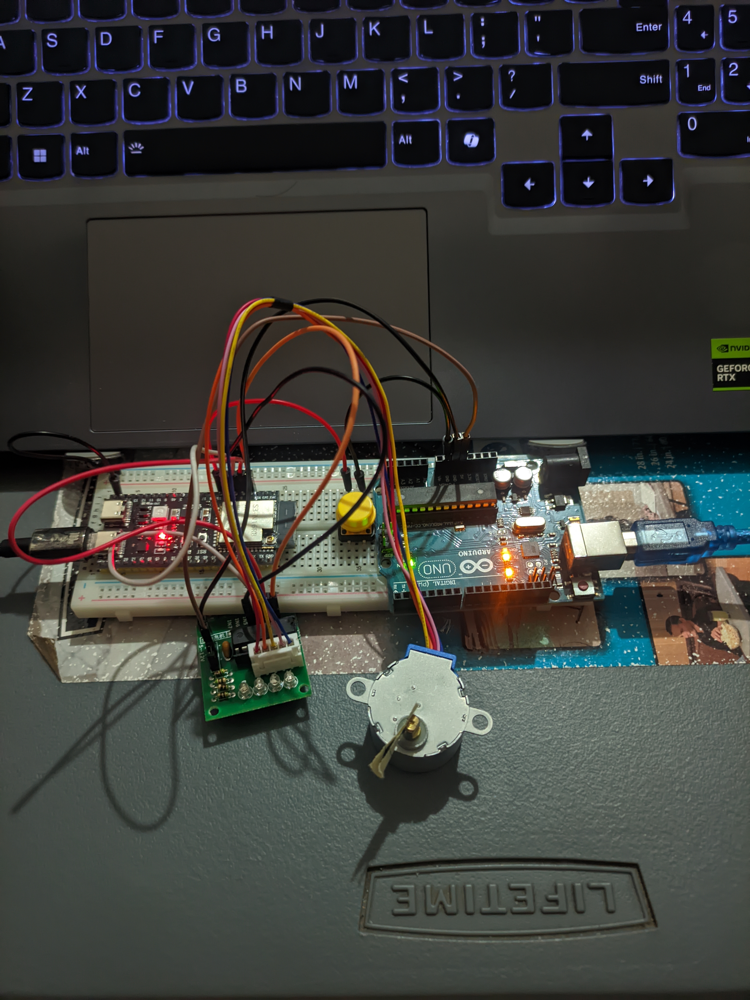

<h1 align="center"> Laboratory Activity 6 Basic Actuator Control</h1>

<strong>Hold the button to run the stepper motor. Release it to stop.</strong>

<a href="#project-overview"> Overview</a> · <a href="#wiring"> Wiring</a> · <a href="#how-the-sketch-works"> Sketch</a> · <a href="#observed-results"> Results</a> · <a href="#wiring-photo-and-demo"> Demo</a>

 

<h2 id="project-overview"> Project overview</h2>

This project uses an ESP32-S3, a 28BYJ-48 5 V stepper motor, and a ULN2003 driver board. Holding the push button runs a repeating four-step sequence. Releasing it sets all four driver inputs LOW, stopping the motor and switching off the driver indicator LEDs.

The assignment's Example 7 describes a brushed DC motor driver with `AIN1`, `AIN2`, `nSLEEP`, and `VM`. The available hardware is a stepper motor and ULN2003 board, so the actuator and driver signals were adapted while keeping the required button-controlled run/stop behavior.

 Tested Lab 6 hardware setup

<h2 id="hardware"> Hardware</h2>

| Component | Hardware used |
| --- | --- |
| Microcontroller | ESP32-S3-N16R8 |
| Motor | 28BYJ-48 5 V unipolar stepper motor |
| Motor driver | Generic ULN2003 board with ULN2003AN IC |
| Button | Momentary push button, using the ESP32 internal pull-up |
| Motor supply | Arduino 5 V and GND pins |

The Arduino board supplies 5 V to the ULN2003 board. The ESP32-S3 controls the motor phases. Join the Arduino, ULN2003, and ESP32 grounds. The motor connects to the ULN2003's 5-pin socket; do not connect its coils directly to ESP32 GPIO pins.

<h3> Motor and driver notes</h3>

The motor casing is marked **28BYJ-48 5V** and has no manufacturer name. The original report lists these model-reference specifications:

| Motor specification | Reference value |
| --- | ---: |
| Phases / coil type | 4 / unipolar |
| Winding resistance | 50 Ω ±7% at 25 °C |
| Gear reduction | 1/64 |
| Stride angle | 5.625° / 64 |
| Reference frequency | 100 Hz |

The referenced motor document does not give a brushed-DC-style stall-current rating. Using the nominal winding resistance, `5 V / 50 Ω ≈ 0.10 A` per energized winding before driver voltage drop. This full-step sequence energizes two windings, for a nominal winding-current total of about 0.20 A; that calculation is not a datasheet stall-current rating.

The ULN2003 is a seven-channel Darlington transistor array. The report lists a 50 V maximum output voltage and a 500 mA rated collector current per output for the IC. This project uses a 5 V motor supply and four driver inputs: `IN1`–`IN4`.

<h2 id="wiring"> Wiring</h2>

### ESP32-S3 to ULN2003

| ESP32-S3 | ULN2003 board | Role |
| --- | --- | --- |
| GPIO4 | IN1 | Stepper phase input 1 |
| GPIO5 | IN2 | Stepper phase input 2 |
| GPIO6 | IN3 | Stepper phase input 3 |
| GPIO7 | IN4 | Stepper phase input 4 |
| GND | GND / `−` | Common ground |

### Push button

Connect GPIO15 to one button terminal and GND to the other. The sketch configures GPIO15 as `INPUT_PULLUP`: it reads HIGH when released and LOW when pressed.

### Motor power

| Supply connection | ULN2003 board |
| --- | --- |
| Arduino 5 V | `+` |
| Arduino GND | `−` / GND |
| ESP32-S3 GND | Same common ground |
| 28BYJ-48 connector | 5-pin motor socket |

<h3> Example 7 signal adaptation</h3>

| Example 7 signal or behavior | This stepper-motor setup |
| --- | --- |
| `AIN1` / `AIN2` | Four phase inputs, `IN1`–`IN4` |
| `nSLEEP` LOW to disable | `motorOff()` sets all four inputs LOW |
| `nSLEEP` HIGH to enable | Phase sequence runs while the button is held |
| `VM` motor supply | 5 V supply connected to the ULN2003 board |
| DC motor run / coast | Stepper rotates / coils are de-energized |

The ULN2003 board has no `nSLEEP` input. Setting `IN1`–`IN4` LOW disables the motor phases for this sketch; it is not a hardware sleep mode.

<h2 id="how-the-sketch-works"> How the sketch works</h2>

The sketch is [`Paraguya_Laboratory_Activity_6_Basic_Actuator_Control.ino`](Paraguya_Laboratory_Activity_6_Basic_Actuator_Control.ino).

`setup()` configures GPIO4–GPIO7 as outputs, sets GPIO15 as an input with the internal pull-up, and calls `motorOff()` so the outputs start LOW. In `loop()`, the program checks the button. While it reads LOW, it advances through the four phase states, waits 10 ms, and repeats. When the button reads HIGH, it turns all four phases off.

| Step | IN1 | IN2 | IN3 | IN4 |
| ---: | :---: | :---: | :---: | :---: |
| 1 | HIGH | HIGH | LOW | LOW |
| 2 | LOW | HIGH | HIGH | LOW |
| 3 | LOW | LOW | HIGH | HIGH |
| 4 | HIGH | LOW | LOW | HIGH |

The four states repeat while the button is held. The recorded hardware test showed clockwise rotation at a 10 ms step delay.

<h2 id="observed-results"> Observed results</h2>

| Test | Observed behavior | Result |
| --- | --- | :---: |
| Power on with button released | Motor stayed stopped; ULN2003 LEDs were off | Pass |
| Press and hold the button | Motor rotated continuously | Pass |
| Rotation quality and direction | Smooth, clockwise rotation | Observed |
| Release the button after running | Motor stopped and driver LEDs turned off | Pass |
| Hold the button during ESP32 reset | Motor paused during reset and resumed after startup | Pass |
| Remove the motor supply | Motor did not run | Expected |

The optional PWM extension was not performed. The assignment describes PWM speed control for a brushed DC motor. This 28BYJ-48 stepper is driven by its phase sequence and step interval, so the same PWM-duty experiment was not carried out.

<h2 id="wiring-photo-and-demo"> Wiring photo and demo</h2>

The wiring photo is shown above. The hardware demonstration is in `media/demo.mp4`:

 Hardware demonstration video

[Open `demo.mp4`](media/demo.mp4)

GitHub does not render repository MP4 files as players inside a README. Opening the link shows GitHub's video file view. GitHub's inline video player is available for videos attached to issue or pull-request comments. [GitHub attachment instructions](https://docs.github.com/en/github-cli/github-cli/attaching-files)

<h2 id="references"> References to add</h2>

The original README has placeholders for the two datasheet links. Add the exact documents used for the report before submission:

- 28BYJ-48 5 V stepper motor reference datasheet
- ULN2003AN / ULN2003A datasheet

<h2 id="submission-checklist"> Submission checklist</h2>

- [x] Button-held motor run and release-to-stop behavior recorded
- [x] GPIO assignments and power wiring documented
- [x] Example 7 hardware substitutions explained
- [x] Step sequence and observed results included
- [x] Wiring photo and hardware video linked
